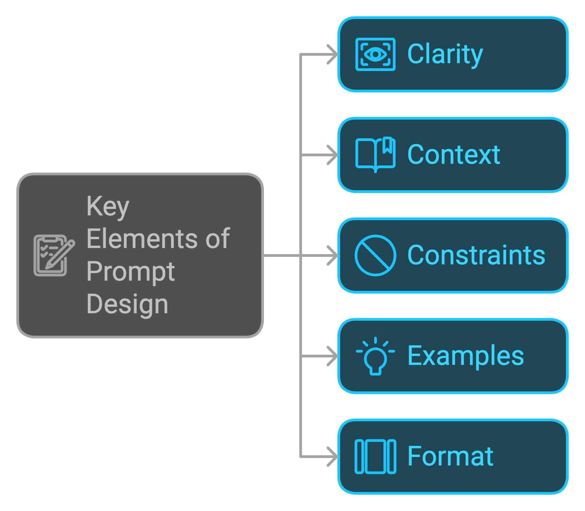

## 📖 Fundamentals of Prompt Design

When designing prompts, consider these key elements:

## Key Elements of Prompt Design

- ✨ **Clarity**: Be specific and unambiguous in your instructions.
- 🏛️ **Context**: Provide relevant background information.
- 🚧 **Constraints**: Set boundaries for the AI's response.
- 🧪 **Examples**: Include sample inputs and outputs when possible.
- 🗂️ **Format**: Specify the desired structure of the response.

## 📌 Common Prompt Techniques

Click to expand the list of common prompt techniques

- 🧠 **Chain of Thought (CoT)**: Enhance reasoning by articulating intermediate steps.
- 🚀 **Zero-Shot Chain of Thought (Zero-Shot-CoT)**: Apply CoT without prior examples or training.
- 🎯 **Few-Shot Chain of Thought (Few-Shot-CoT)**: Use examples to guide the reasoning process.
- 🤔 **ReAct (Reasoning and Acting)**: Combine reasoning with action to improve responses.
- 🌳 **Tree of Thoughts (ToT)**: Organize thoughts hierarchically for better decision-making.
- 🔄 **Self-Consistency**: Ensure stable and consistent responses across queries.
- 📄 **Hypothetical Document Embeddings (HyDE)**: Use embeddings to represent potential documents.
- 🏗️ **Least-to-Most Prompting**: Start simple and gradually increase complexity.
- 🔗 **Prompt Chaining**: Connect multiple prompts for a coherent narrative.
- 📊 **Graph Prompting**: Use graph structures to represent complex relationships.
- 🔄 **Recursive Prompting**: Iteratively refine prompts to enhance results.
- 💡 **Generated Knowledge**: Utilize generated content for further reasoning.
- ⚙️ **Automatic Reasoning and Tool-Use (ART)**: Automate reasoning processes and tool interactions.
- 🛠️ **Automatic Prompt Engineer (APE)**: Tools to automatically generate and refine prompts.
