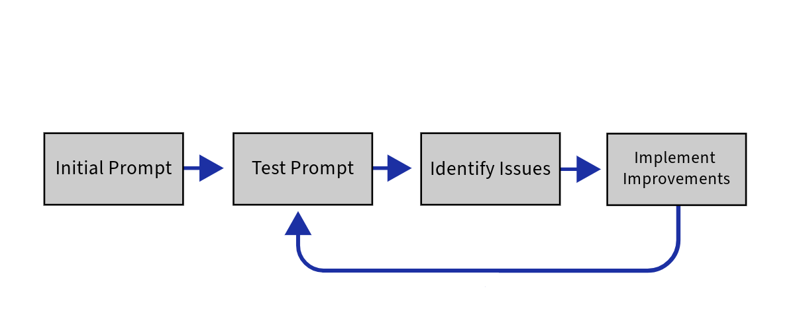

## 🎯 Crafting Effective Prompts: Key Elements

Prompt engineering is like fine-tuning a machine - it's all about tweaking and improving! Here's how it works:

1. 🖊️ Start with your best guess at a good prompt (Initial Prompt)
2. 🧪 Test it out and see what happens (Test Prompt)
3. 🔍 Spot what's not quite right (Identify Issues) 
4. 🛠️ Make it better (Implement Improvements)
5. 🔄 Repeat!

Each time you go through this loop, your prompt gets a little smarter. It's like leveling up in a game - you keep playing and improving until you ace it! Remember, the perfect prompt rarely happens on the first try. It's all about practice and patience.

When designing prompts for AI models, consider these essential components:

Select the dropdowns below to learn about the key elements to writing effective prompts👇🏽

### 🔍 Clear Objective
Precisely define your desired outcome or task.

> **Example:** "Generate a list of 10 creative writing prompts for high school students."

### 🎭 Role Assignment
Give the AI a specific persona to guide its response style.

> **Example:** "You are a creative writing instructor..."

### 🌍 Contextual Background
Provide relevant information to frame the task.

> **Example:** "These prompts will be used in a summer writing workshop for teens."

### 📝 Step-by-Step Instructions
Break down complex tasks into manageable parts.

> **Example:** "First, brainstorm themes suitable for teens. Then, create prompts that..."

### 📊 Output Format
Specify how you want the information presented.

> **Example:** "Present each prompt as a numbered list item with a brief explanation."

### 🚧 Constraints and Parameters
Set clear boundaries for the AI's response.

> **Example:** "Each prompt should be 1-2 sentences long and appropriate for ages 14-18."

---

### 💡 Pro Tips

Click for pro tips on prompt crafting

- While including a role and clear objective is highly recommended for most prompts, it's not always mandatory.
- The most effective prompts provide sufficient guidance while allowing the AI some creative flexibility.
- Tailor your prompt structure to your specific needs for optimal results!

> 🔑 **Remember:** The key to great prompts is balancing direction with flexibility. Give the AI enough context to understand your needs, but leave room for it to leverage its full capabilities.

---

📝 Practice Exercise

Try crafting a prompt using the elements discussed above. Choose a topic you're interested in and create a prompt that includes:

1. A clear objective
2. A role for the AI
3. Contextual background
4. Step-by-step instructions
5. Desired output format
6. Any relevant constraints

